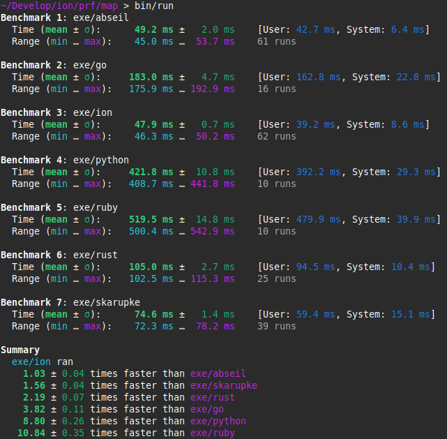

  <h1>⚡️ION⚡️</h1>
  <h3>Super C harge!</h3>

## Map Performance

### Background

The ⚡️ION⚡️ `map` container is a hash table of key/value pairs. A lot of research and
development has been poured on this topic, with remarkable achievements, but we feel
that the endeavour of giving a generalized tool, skirting over some important details,
has overall reduced the hash maps performance in favor of a (claimed) better developer
experience.

For instance, specifying a hash map capacity beforehand, when there is the possibility
to know it, can have huge performance benefits by avoiding unnecessary rehashes. Most,
if not all, of hash map implementations in various languages, do not expose this
capability.

Another huge performance benefit is the ability to specify a custom hasher or comparer
function when dealing with user defined types. Many languages expose this capability via
virtual functions on object instances, but these functions cannot be inlined and
optimized by the compiler, missing out on a big performance gain. The only language that
does this is C++, which provides, not surprisingly, the fastest hash map implementations.

C, however, can offer the same amount of customization, while maintaining its pristine
imperative syntax, resulting in what we believe the best option so far.

### Benchmarks

⚡️ION⚡️ hash map, is, to the best of our knowledge, the fastest hash map implementation
with real type containers. It outperforms C++ implementation like [abseil](
https://abseil.io/docs/cpp/guides/container) from Google, and Malte Skarupke's
[I wrote the fastest hash table](
https://probablydance.com/2018/02/26/i-wrote-the-fastest-hashtable/).

  

The full source code of all benchmarked implementations can be found in the [/prf/map](
map) directory.
